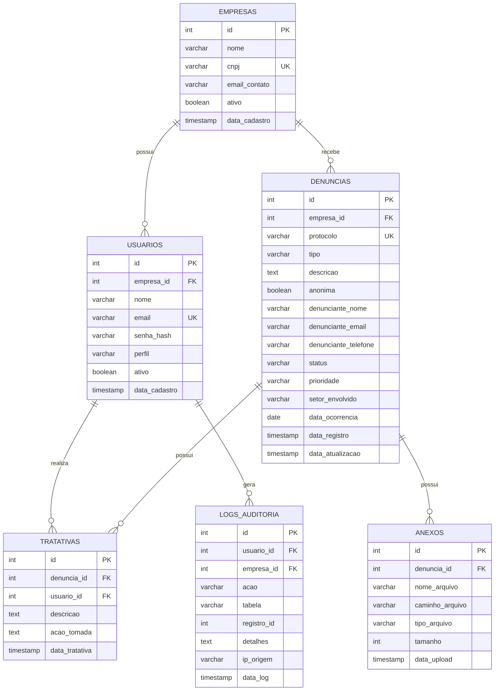

# Diagrama Entidade-Relacionamento

## Modelo de Dados

## Relacionamentos

### EMPRESAS → USUARIOS (1:N)
- Uma empresa possui vários usuários
- Cada usuário pertence a uma empresa

### EMPRESAS → DENUNCIAS (1:N)
- Uma empresa recebe várias denúncias
- Cada denúncia pertence a uma empresa

### USUARIOS → TRATATIVAS (1:N)
- Um usuário realiza várias tratativas
- Cada tratativa é realizada por um usuário

### DENUNCIAS → ANEXOS (1:N)
- Uma denúncia pode ter vários anexos
- Cada anexo pertence a uma denúncia

### DENUNCIAS → TRATATIVAS (1:N)
- Uma denúncia possui várias tratativas
- Cada tratativa pertence a uma denúncia

### USUARIOS → LOGS_AUDITORIA (1:N)
- Um usuário gera vários logs
- Cada log é gerado por um usuário

## Índices

- `idx_denuncias_empresa`: Otimiza consultas por empresa
- `idx_denuncias_status`: Otimiza filtros por status
- `idx_denuncias_protocolo`: Otimiza busca por protocolo
- `idx_usuarios_empresa`: Otimiza consultas de usuários por empresa
- `idx_usuarios_email`: Otimiza login por email
- `idx_logs_usuario`: Otimiza consultas de logs por usuário
- `idx_logs_data`: Otimiza consultas de logs por período

## Constraints

### Check Constraints
- `perfil`: admin, cipa, rh, gestor
- `tipo`: assedio_moral, assedio_sexual, discriminacao, condicao_insegura, risco_saude, outro
- `status`: aberta, em_analise, em_investigacao, concluida, arquivada
- `prioridade`: baixa, media, alta, urgente

### Unique Constraints
- `empresas.cnpj`: CNPJ único por empresa
- `usuarios.email`: Email único por usuário
- `denuncias.protocolo`: Protocolo único por denúncia

### Foreign Keys
- Todas com ON DELETE CASCADE ou RESTRICT conforme regra de negócio
- Garantem integridade referencial

## Triggers

### trigger_atualizar_denuncia
- Atualiza automaticamente `data_atualizacao` em denúncias
- Executado antes de UPDATE

## Funções

### gerar_protocolo()
- Gera protocolo único no formato: DEN + AAAAMMDD + 4 dígitos aleatórios
- Exemplo: DEN202402170001
